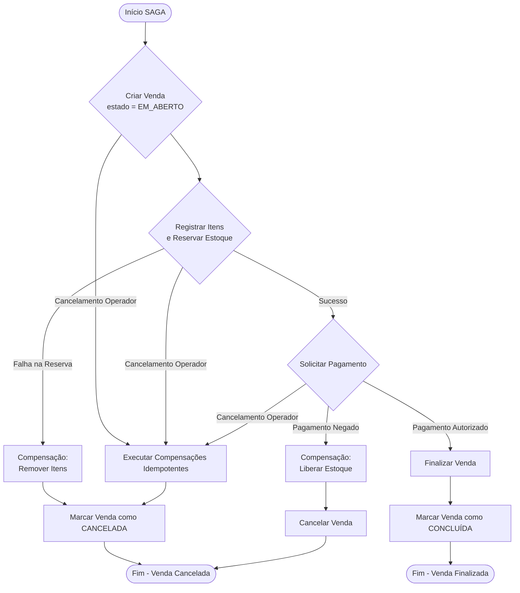

# Arquitetura centrada na consistência/Consistency-Centric Architecture
— Hugo Bastos Bucker

Arquitetura Centrada na Consistência é uma abordagem que coloca a preservação de invariantes e a modelagem explícita de falhas como eixo central da estrutura do sistema. Arquitetura deveria ser pensada a partir da consistência como prioridade epistemológica, unificando as melhores práticas de mercado, sem distinção ou evangelização, de forma pragmática utilizando o melhor dos mundos.

* * *

# A Ilusão do CRUD

Primeiramente, quero abordar um problema não raro, a ilusão do desenvolvedor em tratar todos os sistemas como CRUD, mesmo de forma inconsciente.

Todo sistema começa simples.

Um desenvolvedor recebe a demanda: "precisamos de um sistema de frente de caixa".
Ele modela algumas tabelas: `venda`, `item_venda`, `pagamento`.
Cria endpoints REST.
Implementa operações básicas:

* criar venda
* adicionar item
* registrar pagamento
* finalizar
* cancelar

Funciona. Passa nos testes manuais. Entra em produção. E então o mundo real começa.

## O sistema que parecia correto

No modelo inicial, a estrutura é direta:

```
venda(id, estado, total)
item_venda(id, venda_id, produto_id, quantidade, preco_unitario)
pagamento(id, venda_id, valor, status)
```

A aplicação segue o fluxo:

```java
venda.setEstado("FINALIZADA");
repository.save(venda);
```

Do ponto de vista estrutural, nada impede essa transição, o banco aceita, a API responde 200 OK, mas a pergunta essencial nunca foi feita:

> Quais são as invariantes que garantem que uma venda possa ser finalizada?

Sem essa pergunta, o sistema é apenas um CRUD sofisticado.

## O primeiro incidente

Um operador registra itens, o cliente paga parcialmente em dinheiro, o sistema, por um erro de interface, envia o comando de finalização antes da confirmação do pagamento no gateway. A venda é marcada como `FINALIZADA`, minutos depois descobre-se que o pagamento foi recusado.

O resultado é concreto: a venda está encerrada, o estoque foi decrementado, o ERP foi notificado — mas o dinheiro nunca entrou. Não é um bug sintático, é uma violação de consistência.

Esse tipo de erro não é detectado por testes unitários superficiais nem por validações de DTO. Ele ocorre porque o sistema foi modelado como manipulação de dados, não como preservação de regras.

## Onde o CRUD falha

CRUD assume que:

* estados são apenas valores em colunas
* transições são livres
* consistência é responsabilidade do fluxo externo

Mas em sistemas transacionais reais, o estado carrega semântica. Segundo Eric Evans, em *Domain-Driven Design* (2003), um modelo de domínio deve proteger suas invariantes internamente. Quando a lógica é externalizada para serviços procedurais e setters públicos, temos o chamado *Anemic Domain Model*, criticado também por Martin Fowler (2002).

No nosso exemplo da frente de caixa, existem invariantes formais:

1. O total da venda deve ser igual à soma dos itens.
2. Uma venda só pode ser finalizada se o pagamento estiver autorizado.
3. Após finalizada, nenhum item pode ser adicionado.
4. Uma venda cancelada não pode voltar ao estado anterior.

Essas regras não são detalhes. São restrições semânticas do negócio. Se o sistema permite que `estado = FINALIZADA` seja atribuído diretamente, então o modelo não protege o negócio — ele apenas armazena dados.

## A falha estrutural invisível

Considere outro cenário, o gateway de pagamento autoriza a transação, antes do commit no banco, a aplicação sofre um crash, o pagamento foi aprovado, a venda não foi registrada como paga, temos agora uma inconsistência distribuída.

O problema não é apenas técnico, é financeiro, o cliente foi cobrado, o sistema não reconhece a venda, alguém terá que reconciliar manualmente.

Esse tipo de falha decorre da suposição implícita de que operações são atômicas apenas porque usamos transações locais. Porém, como discutido por Garcia-Molina e Salem no artigo *Sagas* (1987), transações distribuídas exigem coordenação explícita quando múltiplos recursos participam do mesmo fluxo.

## A transição de mentalidade

O erro central não está no código, está no paradigma, enquanto o sistema for tratado como um conjunto de operações CRUD, ele será estruturalmente permissivo. Permissividade estrutural gera inconsistência silenciosa. Arquitetura não existe para organizar pacotes, ela existe para impor restrições.

Robert C. Martin, em *Clean Architecture* (2017), argumenta que a arquitetura deve proteger as regras de negócio das decisões voláteis. Essa proteção inclui impedir que estados inválidos existam, mesmo que desenvolvedores cometam erros.

Arquitetura é um mecanismo de contenção, no contexto da frente de caixa, isso significa:

* A entidade `Venda` não expõe setters arbitrários.
* A transição para `FINALIZADA` é um comportamento, não uma atribuição.
* A autorização de pagamento é validada como pré-condição.
* Estados intermediários são explícitos.
* Falhas são modeladas, não ignoradas.

A modelagem deixa de ser estrutural e passa a ser semântica.

## Do dado ao comportamento

Em vez de:

```java
venda.setEstado("FINALIZADA");
```

temos:

```java
venda.finalizar();
```

E dentro desse método:

```java
if (!pagamento.estaAutorizado())
    throw new ViolacaoDeInvariante();

if (total() <= 0)
    throw new ViolacaoDeInvariante();

estado = FINALIZADA;
```

Aqui o Aggregate Root se torna a fronteira de consistência, conforme descrito por Evans. A responsabilidade muda:

* A aplicação coordena.
* O domínio decide.
* A arquitetura impõe limites.

## A ilusão revelada

CRUD cria a ilusão de que manipular dados é suficiente para representar um sistema, mas sistemas transacionais reais não falham por falta de endpoints, eles falham por falta de modelagem de consistência, quando a venda pode ser finalizada sem pagamento, o problema não é um bug isolado. Quando uma autorização ocorre e o estado não é persistido corretamente, o problema não é apenas de infraestrutura, é ausência de coordenação transacional explícita, quando dois operadores finalizam simultaneamente a mesma venda, o problema não é concorrência acidental, é ausência de fronteira de consistência. 

Arquitetura existe para antecipar essas falhas antes que elas se tornem prejuízo.

## Bases conceituais

Essa abordagem se ancora em três pilares conceituais:

* **Invariantes e Aggregates** — Evans, *Domain-Driven Design* (2003)
* **Modelagem rica vs anêmica** — Fowler, *Patterns of Enterprise Application Architecture* (2002)
* **Isolamento de regras de negócio** — Martin, *Clean Architecture* (2017)
* **Transações distribuídas e Sagas** — Garcia-Molina & Salem (1987)

Todos convergem para a mesma conclusão: **_Sistemas confiáveis são aqueles cuja arquitetura protege a consistência como propriedade estrutural._**

A arquitetura centrada na consistência não é um novo estilo arquitetônico. É uma lente de tomada de decisão.

No nosso exemplo, a frente de caixa não é um conjunto de tabelas, é um sistema que manipula dinheiro, estoque e obrigações fiscais, e isso se aplica a centenas de milhares de outros cenários reais.

Quando tratamos como CRUD, ele é frágil, quando tratamos como modelo comportamental com invariantes explícitas, ele se torna resiliente.

A ilusão do CRUD termina quando entendemos que consistência não é consequência do banco de dados — é consequência do modelo.

* * *

## 1. Fudamentos Formais

Antes de avançarmos ao ponto central desta discussão, considero importante nivelarmos o entedimento de todos os leitores sobre algumas teorias abordadas à frente, e é claro, se você já tem entendimento sobre Invariantes Formais, Consistência Eventual, SAGA Orquestrada e Transactional Outbox, fique à vontade de pular para o próximo capítulo.

### 1.1 Invariantes Formais

Invariantes formais são propriedades que devem permanecer verdadeiras durante toda a vida útil de um sistema, independentemente do fluxo de execução. Elas definem os limites estruturais do domínio: se uma dessas propriedades deixa de ser satisfeita, o sistema entra em um estado semanticamente inválido. Hoare formalizou o uso de invariantes na lógica de programas (1969), demonstrando que determinadas propriedades precisam permanecer verdadeiras antes e depois de cada iteração ou transição para que a correção seja provada matematicamente (Hoare, 1969). Essa ideia, originalmente aplicada a invariantes de laço, evoluiu para um princípio geral de integridade estrutural em sistemas de software.

Aplicando o conceito a um sistema de frente de caixa, podemos observar as invariantes como leis do domínio comercial. Uma venda não pode possuir itens com quantidade negativa; o total da venda deve ser igual à soma dos seus itens; uma venda finalizada deve possuir pagamentos cuja soma corresponda exatamente ao valor devido; uma venda cancelada não pode aceitar novas mutações de estado. Essas propriedades não são apenas validações de entrada, mas condições globais que definem o que significa "uma venda válida".

Ao modelar tecnicamente o domínio, as invariantes tornam-se predicados formais sobre o estado do agregado Venda. Em termos matemáticos:

* ∀ item ∈ venda.itens: item.quantidade > 0 ∧ item.precoUnitario ≥ 0[^1]
* venda.total = Σ (item.quantidade × item.precoUnitario)
* venda.status = FINALIZADA ⇒ Σ pagamentos.valor = venda.total
* venda.status = CANCELADA ⇒ ¬(adicionarItem ∨ registrarPagamento)[^2]

Bertrand Meyer consolida esse raciocínio no conceito de _Design by Contract_, no qual classes definem invariantes que devem ser verdadeiras antes e depois de qualquer operação pública (Meyer, 1997). No contexto orientado a objetos, Venda atua como o guardião dessas propriedades: qualquer mutação interna deve preservar as condições estabelecidas. Isso implica encapsulamento rigoroso e transições de estado controladas.

Eric Evans transporta essa responsabilidade para o nível arquitetural ao definir o conceito de _Aggregate_ em _Domain-Driven Design_, afirmando que o **_Aggregate Root_** é responsável por garantir a consistência e preservar as invariantes do modelo (Evans, 2003). No sistema de frente de caixa, Venda é o agregado; Item de Venda e Pagamento são entidades internas cujo ciclo de vida depende dela. Assim, não se deve permitir que um Pagamento seja registrado fora do contexto de validação da própria Venda.

Quando avançamos para arquiteturas distribuídas, a discussão ganha profundidade. Leslie Lamport demonstra que invariantes são fundamentais para raciocinar sobre concorrência e consistência em sistemas distribuídos, sendo o principal instrumento para provar que um sistema mantém propriedades de segurança mesmo sob _interleavings_ arbitrários de eventos (Lamport, _Specifying Systems_, 2002). Em um cenário onde o módulo de Pagamento é um serviço externo, a igualdade entre total da venda e total pago pode deixar de ser uma invariante imediatamente forte para se tornar uma propriedade de convergência, exigindo mecanismos como Sagas ou compensações para restaurar a coerência.

Martin Fowler complementa essa visão ao destacar que a consistência transacional deve ser delimitada por fronteiras bem definidas, evitando que regras críticas dependam de múltiplos contextos distribuídos sem coordenação adequada (martinfowler.com). Assim, a decisão arquitetural sobre o que manter atomicamente consistente e o que permitir consistência eventual é, em essência, uma decisão sobre quais invariantes são inegociáveis em tempo real.

No sistema de frente de caixa, tratar invariantes como elementos formais significa:
- Definir explicitamente as propriedades estruturais do domínio.
- Garantir que cada transição de estado preserve essas propriedades.
- Delimitar agregados de forma que as invariantes críticas sejam mantidas sob uma única fronteira transacional.
- Utilizar mecanismos de compensação ou coordenação quando invariantes atravessam múltiplos serviços.

Em síntese, invariantes formais conectam teoria e prática: da lógica axiomática de Hoare à modelagem contratual de Meyer, da responsabilidade de agregados em Evans ao raciocínio distribuído de Lamport. Elas não são meras regras de negócio; são condições de segurança estrutural do sistema. Ignorá-las resulta em inconsistência silenciosa; formalizá-las produz sistemas previsíveis, auditáveis e resilientes.

[^1]: todos os itens da venda possuem (quantidade > 0 e preço unitário >= 0)
[^2]: sempre que a venda estiver CANCELADA, qualquer tentativa de adicionar item ou registrar pagamento deve ser proibida.

* * *

### 1.2 Fronteiras transacionais

_Eventual consistency_ é um modelo de consistência distribuída no qual o sistema não garante que todos os nós estejam sincronizados no mesmo instante, mas assegura que, na ausência de novas atualizações, todos convergirão para o mesmo estado ao longo do tempo. Intuitivamente, trata-se de aceitar que "agora" pode haver pequenas divergências entre partes do sistema, desde que "em breve" exista convergência determinística. Em um sistema de frente de caixa, isso significa que, após registrar uma venda, pode haver um pequeno intervalo até que os módulos de pagamento, cancelamento ou relatórios enxerguem exatamente o mesmo estado daquela transação. O usuário não percebe inconsistência funcional; ele percebe apenas latência de propagação.

Quando modelamos tecnicamente _eventual consistency_, estamos lidando com sistemas distribuídos que priorizam disponibilidade e tolerância a partições, conforme descrito pelo teorema CAP (Brewer, 2000; Gilbert & Lynch, 2002). Em um ambiente de frente de caixa com múltiplos terminais operando simultaneamente, cada módulo — Venda, Item de Venda, Pagamento, Cancelamento e Finalização — pode estar desacoplado por meio de eventos. Ao registrar uma venda, o módulo de Venda publica um evento SaleCreated. O módulo de Item de Venda reage adicionando itens e emitindo ItemAdded. O módulo de Pagamento consome o estado projetado da venda para autorizar o pagamento, emitindo PaymentAuthorized. A Finalização consolida os eventos e marca a transação como concluída. Se ocorrer um Cancelamento, um evento SaleCancelled dispara compensações.

Nesse modelo, não há uma única transação ACID envolvendo todos os módulos. Cada agregado mantém consistência forte apenas dentro de seus próprios limites transacionais — conceito alinhado com DDD (Evans, 2003) — enquanto a consistência global é alcançada por propagação assíncrona de eventos. Técnicas como _event sourcing_ (Fowler, 2005) e padrões de mensageria confiável garantem idempotência, ordenação lógica e reprocessamento seguro. Se o pagamento for autorizado antes de todos os itens serem replicados em um serviço de relatório, isso não compromete a integridade da venda; apenas indica que o read model ainda está se atualizando.

As implicações arquiteturais são profundas. _Eventual consistency_ exige que a modelagem seja orientada a eventos, que os contratos sejam explícitos e que os consumidores sejam resilientes a leituras temporariamente desatualizadas. Surge a necessidade de versionamento de eventos, controle de concorrência otimista e mecanismos de compensação (padrão Saga) para coordenar fluxos distribuídos. Em nosso sistema de frente de caixa, a Finalização não deveria depender de locks distribuídos sobre Venda e Pagamento; ela deveria reagir a eventos confirmatórios, garantindo que a convergência do estado seja determinística. Se um terminal cair após registrar a venda, o sistema deve ser capaz de reprocessar eventos a partir do log, assegurando consistência eventual sem perda de integridade.

Na prática, isso permite alta disponibilidade mesmo sob falhas parciais. Um terminal pode continuar registrando vendas localmente e sincronizar posteriormente. O estoque pode ser ajustado de forma assíncrona. Relatórios financeiros podem refletir um pequeno atraso, mas convergirão. O custo dessa abordagem é a complexidade cognitiva: o arquiteto precisa desenhar invariantes claras dentro de cada agregado e aceitar que a consistência global é probabilística no curto prazo, mas garantida no longo prazo.

Em termos teóricos, _eventual consistency_ está fundamentada nos estudos de Brewer sobre sistemas distribuídos (Brewer, "Towards Robust Distributed Systems", 2000), formalizada por Gilbert e Lynch ("Brewer’s Conjecture and the Feasibility of Consistent, Available, Partition-Tolerant Web Services", 2002), além das abordagens práticas descritas por Vogels ("Eventually Consistent", CACM, 2009). No contexto de design orientado a domínio e eventos, referências como Eric Evans ("Domain-Driven Design", 2003) e Martin Fowler ("Patterns of Enterprise Application Architecture", 2002; "Event Sourcing", 2005) consolidam a base conceitual.

_Eventual consistency_ não é uma concessão à inconsistência; é uma escolha arquitetural consciente para sistemas distribuídos que precisam escalar, tolerar falhas e manter disponibilidade. Em um sistema de frente de caixa moderno, ela deixa de ser uma alternativa e passa a ser um mecanismo estruturante para garantir resiliência operacional em ambientes reais e altamente concorrentes.

* * *

### 1.3 SAGA Orquestrada

A SAGA orquestrada é um padrão de consistência distribuída voltado para cenários onde múltiplos serviços precisam colaborar para completar uma transação de negócio, mas sem recorrer a transações distribuídas tradicionais (2PC), que são caras, bloqueantes e pouco resilientes em ambientes modernos baseados em microserviços. De forma intuitiva, pode-se pensar na SAGA como uma transação longa composta por várias transações locais independentes, coordenadas por uma entidade central — o orquestrador — que decide qual é o próximo passo a ser executado e, em caso de falha, qual ação compensatória deve ser disparada. Em vez de garantir atomicidade técnica no nível do banco de dados, a SAGA garante consistência no nível do domínio, por meio de uma sequência controlada de estados.

Tomemos nosso exemplo de sistema de frente de caixa. Ao registrar uma venda, o fluxo de negócio envolve os módulos de Venda, Item de Venda, Pagamento, Cancelamento e Finalização. Em um modelo monolítico tradicional, essa operação poderia estar encapsulada em uma única transação ACID. Entretanto, quando esses módulos são serviços independentes — por exemplo, Venda gerencia o cabeçalho, Item de Venda controla estoque, Pagamento integra com adquirente externa — a atomicidade deixa de ser trivial. A SAGA orquestrada permite que cada módulo execute sua transação local de forma independente, enquanto o orquestrador controla o fluxo: cria a venda, registra os itens, solicita o pagamento, confirma ou cancela conforme o resultado, e por fim finaliza a operação.

Do ponto de vista técnico, a modelagem de uma SAGA orquestrada exige explicitação formal dos estados da transação distribuída. O processo pode ser descrito como uma máquina de estados persistida, onde cada etapa representa uma transação local com semântica clara de sucesso e falha. O orquestrador mantém o estado global — por exemplo: "VENDA_CRIADA", "ITENS_REGISTRADOS", "PAGAMENTO_AUTORIZADO", "FINALIZADA" ou "CANCELADA". Cada transição é disparada por um comando síncrono ou evento assíncrono, e a persistência do estado da SAGA é crítica para tolerância a falhas.

No cenário da frente de caixa, o fluxo poderia ser modelado da seguinte forma (figura 1): o orquestrador inicia criando a entidade Venda em estado "EM_ABERTO". Em seguida, dispara comandos para o serviço de Item de Venda registrar cada item e reservar estoque. Caso a reserva falhe, executa a compensação — remoção dos itens e marcação da venda como cancelada. Se os itens forem registrados com sucesso, o próximo passo é solicitar o Pagamento. Se o pagamento for negado, a compensação envolve liberar estoque e cancelar a venda. Se autorizado, a SAGA transita para Finalização, consolidando a venda como concluída. O Cancelamento é modelado como uma transição alternativa, acionada por falha ou ação do operador, que executa compensações idempotentes nos serviços já envolvidos.


Figura 1 — Fluxograma da SAGA Orquestrada

Do ponto de vista de implementação, há decisões relevantes: comunicação síncrona (HTTP/gRPC) ou assíncrona (mensageria como Kafka ou RabbitMQ), armazenamento do estado da SAGA em banco relacional ou event store, controle de idempotência por chave natural ou identificador global de transação, e uso de padrões como Outbox para garantir atomicidade entre escrita de banco e publicação de eventos. Em ambientes de alta escala, a orquestração tende a ser implementada como um serviço dedicado, com persistência transacional e reprocessamento seguro, garantindo que falhas de infraestrutura não comprometam o fluxo de negócio.

Arquiteturalmente, a SAGA orquestrada traz implicações importantes. Primeiramente, mantêm consistência forte local e consistência eventual global. Isso exige que o domínio aceite estados intermediários e que as entidades sejam projetadas com invariantes explícitas. Em segundo lugar, introduz complexidade operacional: observabilidade torna-se mandatória, pois cada instância da SAGA é uma transação distribuída que pode atravessar múltiplos serviços e filas. Correlação de logs, tracing distribuído e métricas de tempo por etapa deixam de ser opcionais. Em terceiro lugar, a definição correta das ações compensatórias é tão importante quanto as ações principais; compensações devem ser semanticamente corretas, idempotentes e seguras frente a repetição.

Comparativamente ao modelo coreografado — onde os serviços reagem a eventos sem um coordenador central — a orquestração concentra a lógica de fluxo em um único ponto, reduzindo acoplamento implícito e facilitando a compreensão do processo de negócio. No sistema de frente de caixa, isso significa que a regra de "não finalizar venda sem pagamento autorizado" reside no orquestrador, e não dispersa entre múltiplos serviços reagindo a eventos. O custo é a introdução de um componente central crítico, que deve ser altamente disponível e corretamente versionado.

Teoricamente, o padrão SAGA foi introduzido por Garcia-Molina e Salem (1987) como alternativa para transações de longa duração em bancos de dados distribuídos. Em arquiteturas modernas de microserviços, sua aplicação foi amplamente difundida por autores como Chris Richardson, que formalizou variações práticas do padrão no contexto de sistemas orientados a eventos. O uso de compensações como mecanismo de reversão lógica está alinhado com princípios de Domain-Driven Design, especialmente na modelagem de processos de negócio de longa duração.

No nosso contexto do sistema de frente de caixa, a SAGA orquestrada permite escalar cada módulo independentemente, integrar gateways de pagamento externos de forma resiliente e garantir que falhas parciais — como indisponibilidade temporária do adquirente — não comprometam a integridade do processo como um todo. Quando bem modelada, ela não é apenas um mecanismo técnico, mas uma representação explícita do fluxo de negócio, tornando o sistema mais previsível, auditável e evolutivo.

* * *

### 1.4 Transactional Outbox

O padrão _Transactional Outbox_ nasce de um problema clássico de sistemas distribuídos: como garantir consistência entre a atualização do estado interno de uma aplicação e a publicação de um evento para outros sistemas, sem recorrer a transações distribuídas (2PC), que são caras, complexas e pouco resilientes em ambientes modernos baseados em mensageria. De forma intuitiva, pense no nosso sistema de frente de caixa. Ao finalizar uma venda, o sistema precisa persistir os dados da venda no banco e também publicar um evento como `VendaFinalizada` para que outros módulos — estoque, fiscal, BI, antifraude — reajam. Se gravarmos no banco e depois publicarmos no broker (Kafka, RabbitMQ, etc.), há risco de falha entre essas duas etapas. Se publicarmos primeiro e depois falharmos ao persistir, geramos inconsistência ainda pior. O _Transactional Outbox_ resolve isso deslocando o problema: em vez de publicar diretamente no broker dentro da mesma transação, persistimos o evento em uma tabela "outbox" no mesmo commit da operação de negócio. A publicação real ocorre posteriormente, de forma assíncrona e confiável.

Tecnicamente, a modelagem é simples, mas exige disciplina arquitetural. No banco relacional do sistema de frente de caixa, além das tabelas `venda`, `item_venda`, `pagamento`, criamos uma tabela `outbox_event` com colunas como `id`, `aggregate_type`, `aggregate_id`, `event_type`, `payload`, `occurred_at`, `processed_at` e eventualmente `status` ou `retry_count`. Ao registrar uma venda e seus itens, o serviço de aplicação executa uma única transação ACID que persiste os dados da venda e insere um registro na `outbox_event` representando, por exemplo, `VendaCriada`. O mesmo ocorre para `PagamentoAutorizado`, `VendaCancelada` ou `VendaFinalizada`. A atomicidade do banco garante que ou tudo é gravado, ou nada é. Um processo separado — que pode ser um poller, um CDC connector como Debezium ou um mecanismo baseado em log — lê os registros não processados da outbox e publica os eventos no broker. Após publicação bem-sucedida, marca o evento como processado. A idempotência passa a ser requisito estrutural: o consumidor deve suportar _at-least-once delivery_, pois falhas entre publicação e marcação podem causar reenvios. Nesse contexto, chaves naturais ou identificadores globais (UUID) são fundamentais.

No exemplo da frente de caixa, imagine o fluxo completo: ao registrar uma venda com três itens, o sistema grava `venda` e `item_venda` e cria o evento `VendaRegistrada`. O módulo de estoque consome esse evento e reserva os produtos. Quando o pagamento é aprovado, a aplicação persiste o pagamento e cria o evento `PagamentoConfirmado`. Se houver cancelamento, uma nova transação grava cancelamento e gera `VendaCancelada`, acionando a reversão de estoque e estorno financeiro. A finalização consolida o ciclo com `VendaFinalizada`, que pode alimentar o módulo fiscal para emissão de NFC-e. Cada transição relevante de estado gera um evento persistido de forma transacional, assegurando coerência entre o estado do banco e o que é propagado ao ecossistema.

Em termos arquiteturais avançados, o _Transactional Outbox_ é um mecanismo de desacoplamento temporal e de consistência eventual controlada. Ele evita 2PC, favorece arquiteturas orientadas a eventos e é particularmente adequado quando combinamos microsserviços com bancos isolados por serviço. Em ambientes de alta taxa transacional, como um PDV com milhares de vendas por hora, o desenho da outbox precisa considerar índices eficientes (processed_at IS NULL), particionamento por data ou por agregado e políticas claras de retenção. Uma alternativa robusta é integrar o padrão com _Change Data Capture_ (por exemplo, Debezium capturando alterações da tabela outbox e publicando em Kafka), eliminando o polling ativo e reduzindo latência. Em termos de semântica de entrega, a arquitetura normalmente converge para _at-least-once_ com consumidores idempotentes ou para _exactly-once_ apoiada por recursos do broker e controle de offsets, mas sempre reconhecendo que a consistência é eventual. Esse padrão também se integra naturalmente com Sagas, quando o processo de venda envolve múltiplos serviços distribuídos coordenando estados por eventos.

A teoria que fundamenta o padrão está ancorada na impossibilidade prática de manter consistência forte entre múltiplos recursos distribuídos sem custo elevado, conforme discutido no teorema CAP (Brewer, 2000) e na literatura sobre _Distributed Systems_ (Tanenbaum & Van Steen). O padrão é formalmente descrito por Chris Richardson em _Microservices Patterns_ (2018), onde o _Transactional Outbox_ aparece como solução para publicar mensagens de forma confiável sem 2PC. Martin Fowler também discute variações relacionadas em seu catálogo de padrões de integração empresarial, complementando os fundamentos apresentados por Hohpe & Woolf em _Enterprise Integration Patterns_ (2003). No contexto prático do sistema de frente de caixa descrito, o padrão assegura que cada transição — venda, item, pagamento, cancelamento e finalização — seja refletida de maneira consistente no domínio local e no ecossistema distribuído, equilibrando atomicidade local com consistência eventual global.

* * *

### 1.5 Teorema de CAP

O Teorema de CAP, proposto por Eric Brewer e formalizado por Seth Gilbert e Nancy Lynch, estabelece um limite fundamental para sistemas distribuídos: diante de uma partição de rede, é impossível garantir simultaneamente Consistência (Consistency), Disponibilidade (Availability) e Tolerância à Partição (Partition Tolerance). Não se trata de uma escolha arbitrária de engenharia, mas de uma impossibilidade formal demonstrada matematicamente.

Em um nível intuitivo, o teorema afirma que, quando dois nós deixam de se comunicar, o sistema precisa decidir entre continuar respondendo requisições — mesmo correndo o risco de retornar dados divergentes — ou bloquear operações até que o estado global esteja sincronizado. Em outras palavras, quando a rede falha, você escolhe entre "responder sempre" ou "responder sempre corretamente". Em um sistema centralizado, esse dilema não aparece; em um sistema distribuído, ele é inevitável.

Modelando tecnicamente, Consistência no contexto do CAP refere-se à linearizabilidade[^3], toda leitura deve refletir a escrita mais recente, como se existisse uma única linha do tempo global. Disponibilidade significa que todo nó não falho deve responder a requisições em tempo finito. Tolerância à Partição implica que o sistema continua operando mesmo quando há perda arbitrária de mensagens entre nós. A prova de Gilbert e Lynch demonstra que, sob uma partição, garantir linearizabilidade implica recusar operações em pelo menos um dos lados da partição, violando disponibilidade. Já manter disponibilidade implica aceitar operações potencialmente divergentes, violando consistência forte.

Aplicando esse raciocínio à construção de um sistema de frente de caixa distribuído — composto por módulos de Venda, Item de Venda, Pagamento, Cancelamento e Finalização — a tensão torna-se concreta. Imagine múltiplos caixas conectados a um backend distribuído. Se ocorre uma partição entre a loja e o data center, o módulo de Venda pode continuar registrando itens localmente para não interromper o atendimento. Essa decisão prioriza Disponibilidade e Tolerância à Partição (AP), aceitando que o estoque global possa ficar temporariamente inconsistente. Por outro lado, o módulo de Pagamento, especialmente se integrado a adquirentes e antifraude, pode exigir consistência forte: não é aceitável autorizar o mesmo pagamento duas vezes ou concluir uma venda sem confirmação transacional. Nesse caso, sob partição, o sistema pode optar por bloquear a Finalização até restabelecer conectividade, assumindo um comportamento CP.

Em termos arquiteturais avançados, o CAP não classifica sistemas como "CA", "CP" ou "AP" de forma absoluta; a partição é um evento condicional. Em operação normal, um banco relacional como PostgreSQL em modo síncrono pode oferecer consistência forte e alta disponibilidade. Porém, sob falha de replicação síncrona entre regiões, a escolha emerge: promover um standby com possível perda de confirmação (AP momentâneo) ou bloquear commits até quorum[^4] (CP). Sistemas como Apache Cassandra adotam modelo AP por design, oferecendo consistência ajustável via quorum; já Google Spanner busca _external consistency (linearizability)_ através de relógios sincronizados (TrueTime), aceitando latência adicional como custo estrutural.

No sistema de frente de caixa, uma abordagem madura segmenta as garantias por domínio transacional. Venda e Item de Venda podem operar com log local e reconciliação assíncrona via event sourcing, aceitando consistência eventual para manter _throughput_ operacional. Pagamento e Finalização podem exigir consenso distribuído (Raft/Paxos) ou coordenação transacional, assegurando invariantes financeiras. Cancelamento pode ser modelado como compensação idempotente, reduzindo dependência de consistência síncrona. Assim, o desenho arquitetural não escolhe um "lado" do CAP globalmente; ele aplica diferentes estratégias conforme o risco e a criticidade do domínio.

O equívoco comum é interpretar o CAP como uma taxonomia estática de bancos de dados. Na prática, ele é um guia para raciocínio sob falha. Em sistemas reais, a discussão evolui para o espectro entre consistência forte, consistência eventual, quorum, latência, SLA e custo operacional. No frente de caixa, a pergunta não é "qual propriedade sacrificar", mas "em qual módulo, sob qual falha, qual invariável é inegociável".

Teoricamente, o CAP delimita o espaço de possibilidades formais. Na prática, ele orienta decisões como replicação síncrona versus assíncrona, uso de filas para desacoplamento, estratégias de retry e reconciliação, desenho de contratos idempotentes e definição de SLAs por domínio. Um sistema bem arquitetado internaliza o CAP não como limitação, mas como premissa estrutural.

[^3]: é um critério de consistência em sistemas distribuídos. Em termos simples, um sistema linearizável é aquele no qual as operações parecem ocorrer em uma única ordem global, coerente com o tempo real. É como se todas as ações fossem registradas em uma linha do tempo impecável, sem inversões estranhas.
[^4]: significa que uma transação só é considerada confirmada (commit efetivo) quando um número mínimo de réplicas concorda e persiste aquela operação. Enquanto esse número mínimo — o quorum — não for atingido, o nó coordenador não responde sucesso ao cliente. Ele espera. Se não conseguir atingir o quorum (por exemplo, devido a uma partição de rede), o commit é negado ou fica pendente.


Excelente.
Vou traduzir mantendo rigor conceitual e incorporar citações clássicas e pertinentes (Lamport, Brewer, Vogels, Evans, Garcia-Molina & Salem), usando formato acadêmico simples com referências numeradas.

# 2. Três Camadas da Consistência

Consistência é frequentemente tratada como uma única preocupação técnica, normalmente associada a sistemas distribuídos e estratégias de replicação. No entanto, em sistemas complexos, “consistência” opera em três camadas conceitualmente distintas. Não diferenciá-las gera confusão epistemológica e decisões arquiteturais equivocadas.

Essas camadas são: **Modelo de Consistência**, **Consistência de Domínio** e **Consistência Arquitetural**. Elas se relacionam, mas não são intercambiáveis.

## 2.1 Modelo de Consistência (Camada Formal)

Um modelo de consistência pertence ao campo da teoria de sistemas distribuídos. Ele responde a uma pergunta formal e precisa:

> Sob quais condições uma leitura pode observar uma escrita?

Consistência forte, sequencial, causal e eventual definem garantias sobre ordenação, visibilidade e propagação de estado entre nós distribuídos (Lamport, 1979 e Vogels, 2009).

Essa camada trata de:

* Replicação
* Concorrência
* Partições de rede
* Trade-offs entre latência e disponibilidade: CAP (Brewer, 2000), PACELC (Abadi, 2012)

Ela é de natureza matemática. Não compreende regras de negócio. Não raciocina sobre validade semântica.

Um sistema pode ser fortemente consistente do ponto de vista distribuído e, ainda assim, estar incorreto do ponto de vista de negócio.

Modelos de consistência governam **como o estado converge**, não **se o estado é verdadeiro**.

## 2.2 Consistência de Domínio (Camada Semântica)

A consistência de domínio opera em outro plano. Ela responde a uma pergunta semântica:

> O estado atual viola alguma invariante fundamental do negócio?

Aqui, consistência não diz respeito ao tempo de propagação, mas à verdade.

Invariantes de domínio definem estados válidos do sistema, como descrito na modelagem orientada ao domínio (Evans, 2003).

Exemplos:

* O estoque nunca pode ser negativo.
* Um pedido cancelado não pode receber pagamento.
* O total da venda deve ser igual à soma de seus itens.

Essas regras expressam restrições semânticas permanentes.

Um sistema pode satisfazer perfeitamente um modelo formal de consistência e, simultaneamente, violar uma invariante crítica do domínio. Nesse caso, ele é tecnicamente consistente, mas semanticamente inválido.

Consistência de domínio define correção. É o ponto onde a realidade do negócio encontra o estado do sistema.

## 2.3 Consistência Arquitetural (Camada Estrutural)

Consistência arquitetural é a resposta estrutural às invariantes do domínio.

Ela responde à pergunta de design:

> O sistema foi estruturado para proteger suas invariantes sob falhas, concorrência e distribuição?

Essa camada envolve decisões como:

* Delimitação de fronteiras transacionais
* Definição de agregados
* Escolha entre ACID e consistência eventual
* Uso de Sagas e ações compensatórias - (Garcia-Molina & Salem, 1987)
* Estratégias de isolamento
* Validação dentro de boundaries de consistência

Consistência arquitetural não é um novo modelo formal. É o alinhamento deliberado entre estrutura do sistema e preservação de verdade semântica.

Se a consistência de domínio define o que nunca pode ser violado, a consistência arquitetural define como o sistema impede essa violação.

## 2.4 A Hierarquia das Camadas

Essas camadas formam uma hierarquia lógica:

1. Invariantes de domínio definem verdade.
2. Modelos de consistência definem garantias de propagação.
3. Arquitetura define mecanismos de proteção.

Um erro recorrente no design de sistemas é escolher um modelo de consistência antes de identificar invariantes críticas. Outro erro é supor que consistência forte implica correção de negócio.

Consistência no nível de infraestrutura não implica consistência no nível semântico.

Maturidade arquitetural começa quando sistemas são projetados a partir de invariantes, e não a partir de estratégias de replicação.

## 2.5 Esclarecimento Final

Pensar de forma centrada na consistência não significa propor um novo modelo formal de consistência distribuída. Não redefine o Teorema de CAP. Não introduz um novo protocolo transacional. Propõe uma ordem disciplinada de raciocínio:

1. Definir o que deve ser sempre verdadeiro.
2. Compreender as garantias de propagação necessárias.
3. Estruturar a arquitetura para proteger essas verdades.

Somente quando essas três camadas são explicitamente diferenciadas a consistência deixa de ser uma propriedade acidental e passa a ser um princípio deliberado de design.

## 3. Arquitetura de Software como Estrutura de Decisão

Arquitetura de software é a disciplina que define a organização estrutural de um sistema para preservar sua evolução e proteger suas regras de negócio.

De acordo com Robert C. Martin, em _Clean Architecture_, a arquitetura deve tornar o sistema independente de frameworks, banco de dados e detalhes externos. Arquitetura de software não é uma coleção de frameworks nem uma decisão estética. Trata-se da organização estrutural do sistema com o objetivo de preservar **coerência, manutenibilidade e evolução ao longo do tempo**.

Essa visão é coerente com a definição clássica apresentada por Ian Sommerville em _Software Engineering_, onde arquitetura é descrita como a estrutura organizacional de componentes e seus relacionamentos.

Por exemplo, no contexto da frente de caixa, a arquitetura deve garantir que:
*   Trocar o banco de dados não altere as regras de venda.
*   Trocar o gateway de pagamento não exija reescrever o domínio.
*   A interface de usuário não contenha regra de negócio.

Ainda segundo **Robert C. Martin**, a arquitetura deve proteger o negócio das decisões técnicas voláteis. Frameworks mudam. Bancos de dados mudam. Protocolos mudam. As regras de negócio, porém, tendem a permanecer.

Arquitetura é sobre preservar regras de negócio. Se você trocar o banco, a UI ou o gateway de pagamento, o que sobra? Se a resposta for: _"Nada funciona."_, então você não tem arquitetura, você tem acoplamento.

**Arquitetura é, portanto, um mecanismo de isolamento conceitual.**

## O núcleo contém duas coisas:

```plain
Core
│
├── Domain
└── Application 
```

## Domain
Contém:
*   Aggregates
*   Entities
*   Value Objects
*   Domain Events
*   Invariantes

Não conhece:
*   Banco
*   Framework
*   Mensageria
*   HTTP

## Application
Contém:
*   Use Cases
*   Orquestrações
*   Portas (Input/Output)
*   Application Events

**_A Application coordena, o Domain decide._**

# 4. Domínio e Linguagem Ubíqua
O conceito de domínio foi formalizado por Eric Evans em _Domain-Driven Design_. Domínio é o conjunto de regras, conceitos e processos do negócio. Vamos adotar daqui pra frente o exemplo da frente de caixa iniciado lá nos primeiros tópicos desta nossa divagação, nesse contexto, o domínio envolve:

*   Venda
*   Item de Venda
*   Pagamento
*   Cancelamento
*   Finalização

Não envolve:
*   JSON
*   HTTP
*   ORM
*   Banco de dados

Evans introduziu a noção de **linguagem ubíqua**: desenvolvedores e especialistas do negócio devem utilizar os mesmos termos. Se o operador diz "finalizar venda", o código deve conter `finalizar()` — não `updateStatus(3)`. Essa correspondência semântica reduz ambiguidade e aumenta clareza estrutural.

# 5. Aggregate Root e Consistência Interna

Evans define **Aggregate** como um conjunto de objetos associados tratados como uma unidade para fins de consistência, o elemento central é o **Aggregate Root**.

## Quando usar Aggregate Root forte

*   Invariantes reais
*   Regras críticas
*   Estados bem definidos

## Modelo Estrutural da Venda

```gherkin
+-------------------+
|      Venda        |  <<Aggregate Root>>
+-------------------+
| id                |
| estado            |
| total             |
+-------------------+
| adicionarItem()   |
| autorizarPgto()   |
| finalizar()       |
+-------------------+
          | 1
          | 
          |
          | *
+-------------------+
|    ItemVenda      |
+-------------------+
| produtoId         |
| quantidade        |
| precoUnitario     |
+-------------------+
          | 1
          | 
          |
          | 1
+-------------------+
|    Pagamento      |
+-------------------+
| valor             |
| status            |
| transacaoId       |
+-------------------+
```

A **Venda** é o único ponto de entrada para modificações.

`ItemVenda` e `Pagamento` não são manipulados diretamente por camadas externas, com isso é possível garantir que alteração não venha de algum ponto indesejado ou desconhecido, burlando as regras de Domínio.

## 4.1 Modelagem Ingênua (Anêmica)
Martin Fowler critica o chamado _Anemic Domain Model_, que se destaca pelas seguintes características:
* Entidades apenas com getters e setters.
* Regras concentradas em serviços.
* Estado alterado livremente.
* Invariantes frágeis.

Observe o trecho de código abaixo:

```java
venda.setEstado("FINALIZADA");
repository.save(venda);
```

Nesta abordagem nada impede que:
*   Finalize sem pagamento.
*   Finalize com total zero.
*   Finalize venda já encerrada.

Como estamos falando de conceitos, não há restrições que impeçam um desenvolvedor de alterar de forma imprudente ou mesmo ingênua o código, a consistência depende da disciplina e maturidade do desenvolvedor e/ou time.

## Quando usar modelo anêmico
Mas existem casos que realmente o modelo anêmico pode fazer sentido, evitando uma _overengineering_.

*   CRUD simples
*   Operação administrativa
*   Sem regra crítica

A arquitetura suporta ambos, mas nunca misture as responsabilidades.

## 5.2 Modelagem Orientada a Domínio
Olhando para dentro do Domínio, vamos analisar a finalização de uma Venda, numa abordagem adequada temos o método `finalizar()` que é responsável por conhecer todos os processos e particularidades da regra.

```java
class Venda {

    private Estado estado;
    private List<ItemVenda> itens;
    private Pagamento pagamento;

    public void finalizar() {
        validarPagamento();
        validarTotal();
        this.estado = FINALIZADA;
    }
}
```

Veja que não há setters que façam a alteração do estado do objeto de forma externa, quem conhece o que deve ser feito é o Domínio, não é uma flag vinda por um fluxo externo, temos agora algumas Invariantes Formais.

### Invariantes Formais

Seguindo nosso exemplo acima, na finalização de venda, entendemos que algumas proposições precisam ser satisfeitas, tal como: ter recebido a informação do gateway de pagamento que ele foi confirmado, a totalização dos valores dos itens tem que ser igual ao valor autorizado pelo gateway tal qual a soma dos valores dos itens:

1. `total == soma(itens)`
2. `valorRecebido == total`
3. `estado == FINALIZADA → pagamento.status == AUTORIZADO`
4. `estado == FINALIZADA → não pode adicionar itens`

Essas regras residem no próprio **Aggregate Root**. Esse encapsulamento se relaciona com o princípio clássico de ocultação de informação discutido por David Parnas (1972).

# 6. Casos de Uso como Orquestradores Internos

O conceito de Caso de Uso foi difundido por Ivar Jacobson. Casos de uso representam ações completas realizadas por um ator. Quebrar em casos de uso é uma forma de tornarmos mais clara a intenção e a responsabilidade. Por exemplo na frente de caixa:
*   RegistrarItem
*   AutorizarPagamento
*   FinalizarVenda

### Diagrama de Camadas

```gherkin
+-------------------------------------+
|           Interface (API)           |
+-------------------------------------+
                |
                v
+-------------------------------------+
|            Use Case Layer           |
+-------------------------------------+
                |
                v
+-------------------------------------+
|             Domain Layer            |
+-------------------------------------+
                |
                v
+-------------------------------------+
|        Infrastructure Layer         |
+-------------------------------------+
```

**O Caso de Uso coordena, mas não contém a regra central, a regra pertence ao domínio.**

# 7. Transações Não São Infraestrutura

A fronteira transacional deve refletir uma semântica de negócio. A infraestrutura implementa o mecanismo, a Application define a fronteira, desta forma não temos acoplamento da tecnologia às regras do negócio.

## Regra
**O UseCase declara:** _"Este fluxo deve ser consistente."_

**O Adapter executa:** begin, commit ou rollback.

# 8. Portas e Adaptadores

Proposta por Alistair Cockburn, a Arquitetura Hexagonal isola o núcleo do sistema por meio de interfaces (portas).

Entradas e saídas são plugáveis, o caso de uso não sabe quem o chamou, ele apenas executa.

```plain
             [REST]
               │
[Kafka] ──> [UseCase] ──> [Gateway]
               │
            [Repository]
```

Exemplo:

```java
interface PaymentGateway {...}

public class GatewayMercadoPago implements PaymentGateway {...}

public class GatewayCielo implements PaymentGateway {...}

public class GatewayMock implements PaymentGateway {...}
```

Entenda que, neste ponto, o domínio depende da abstração (interface), não da tecnologia, a tecnologia deve ser vista com um detalhe que deve ser postergado ao máximo na sua decisão, pois o Domínio, a Regra do Negócio não deve depender da sua implementação concreta.

# 9. Consistência Distribuída

Em arquiteturas distribuídas baseadas em desacoplamento assíncrono, a consistência eventual tende a emergir como propriedade estrutural. Portanto mitigar problemas de consistência é essencial.

## 9.1 Transação ACID Tradicional

Um modelo transacional de consistência forte, que implementa o ACID, funciona apenas quando a transação envolve um _resource manger_ único, onde a aplicação processa todo fluxo do início ao fim de forma síncrona.

```sql
BEGIN TRANSACTION
  salvar venda
  autorizar pagamento
  atualizar estoque
COMMIT
```

## 9.2 O SAGA Orquestrada

Como explicado anteriormente, O SAGA Orquestrado é uma solução elegante, onde cada etapa possui uma compensação, uma regra que desfaz a operação em caso de falha, permitindo restaurar a coerência por meio de compensações, desde que as compesações sejam corretamente modeladas.

```gherkin
              +------------------+
              |  Saga Orquestr.  |
              +------------------+
                        |
       --------------------------------------
       |                |                    |
       v                v                    v
 Autorizar         Confirmar            Notificar
 Pagamento         Venda                ERP
       |                |                    |
       v                v                    v
 Compensar         Cancelar Venda       Reverter ERP
 Pagamento
```

## 9.3 Comparação Técnica

A questão nem sempre é sobre escrever em pedra o que será utilizado, pois no ecossistema das aplicações, seja ela distribuída ou monolítica, é possível ter consistência forte e a consistência eventual implementadas, haverá fluxos em que a transação tradicional poderá ser usada, e outros em que não será possível, e tratar a consistência eventual da melhor forma possível trará tranquilidade e consistência para a aplicação como um todo, um exemplo simples é a comunicação com o gateway de pagamento, se tratado como consistência eventual, permitirá eficiência ao fluxo de pagamento.


| Critério | ACID | SAGA |
| ---| ---| --- |
| Escopo | Local | Distribuído |
| Consistência | Imediata | Eventual |
| Escalabilidade | Limitada | Alta |
| Bloqueio | Alto | Baixo |

É importante refletir sobre qual é o fluxo da aplicação. Se o fluxo, por exemplo, não possui requisitos de escopo distribuído, pode ser um pouco exagerado utilizar o SAGA para resolver um problema que não existe.

## 9.4 Interação entre SAGA e Aggregate
A SAGA não valida regra interna, por exemplo da Venda, ela apenas coordena passos distribuídos, se o Aggregate for mal modelado, a SAGA apenas amplifica inconsistências.

Ponto central:
* **Aggregate protege consistência interna.**
* **SAGA coordena consistência externa.**

# 10. Consistência Eventual na Prática

Até aqui discutimos invariantes, fronteiras transacionais, SAGA e consistência eventual sob perspectiva estrutural. Agora é necessário deslocar a discussão para o terreno onde arquitetura realmente é testada: produção.

Consistência eventual não é um conceito acadêmico abstrato. Ela se manifesta quando o sistema continua operando apesar de falhas parciais. A questão não é "se" haverá divergência temporária de estado — ela ocorrerá. A questão é: o sistema foi desenhado para absorvê-la de forma controlada?

## 10.1 Aplicação Prática no Sistema de Frente de Caixa

Considere novamente o fluxo de venda:

1. Registrar venda
2. Registrar itens
3. Autorizar pagamento
4. Finalizar venda
5. Notificar ERP
6. Atualizar estoque
7. Emitir documento fiscal

Em um ambiente distribuído, cada etapa pode estar em um serviço distinto. Exigir consistência forte entre todos eles implica:

* Locks distribuídos
* Transações 2PC
* Bloqueios longos
* Alta latência

Em ambientes reais — com múltiplas lojas, instabilidade de rede e gateways externos — isso é impraticável.

A aplicação prática de consistência eventual envolve três decisões arquiteturais claras:

**1. Delimitar fronteiras de consistência forte**

Dentro do Aggregate `Venda`, invariantes são inegociáveis. Por exemplo, o estado não pode ser FINALIZADO sem pagamento autorizado.

Essa consistência é local e transacional.

**2. Permitir convergência assíncrona entre módulos**

Notificação do ERP, atualização do BI e integração fiscal podem ocorrer de forma assíncrona, via eventos persistidos (Outbox).

Se o ERP estiver indisponível:

* A venda não deve ser bloqueada.
* O evento deve permanecer persistido.
* O sistema deve tentar novamente.

**3. Tornar todos os efeitos externos idempotentes**

Sem idempotência, consistência eventual vira inconsistência permanente.

## 10.2 Casos Reais

A seguir, situações que ocorrem em produção — não em diagramas.

### Caso 1 — ERP fora do ar durante o fechamento do caixa

**Cenário:**

* Venda finalizada.
* Evento `VendaFinalizada` gerado.
* ERP indisponível.

**Decisão imatura:**

> Bloquear a venda até o ERP voltar.

**Consequência:**

* Fila no caixa.
* Perda operacional.
* Sistema dependente de terceiros.

**Decisão arquitetural madura:**

* Persistir evento.
* Publicar via Outbox.
* Retry com backoff exponencial.
* Monitoramento de falhas.

O estado global ficará temporariamente inconsistente, mas convergirá.

### Caso 2 — Timeout no gateway de pagamento

**Cenário:**

* Requisição enviada.
* Gateway autorizou.
* Resposta não retornou.

**Sem modelagem adequada:**

* Operador tenta novamente.
* Dupla cobrança.
* Necessidade de estorno manual.

**Com modelagem orientada à consistência:**

* Venda entra em estado `AGUARDANDO_AUTORIZACAO`.
* Transação possui `transacaoId` único.
* Reconciliação posterior consulta gateway.
* Idempotência garante que confirmação duplicada não altera estado.

Consistência eventual não significa aceitar erro — significa tratar incerteza explicitamente.

### Caso 3 — Replicação assíncrona entre regiões

**Cenário:**

* Loja A finaliza venda.
* Serviço de relatórios ainda não recebeu evento.
* Dashboard mostra número inferior ao real.

**O esperado é que:**

O erro não está na divergência temporária. O erro estaria se o sistema não garantisse convergência determinística.

### Caso 4 — Processamento duplicado de evento

Em mensageria real, "exactly-once" é raramente garantido de ponta a ponta.

**Sem idempotência:**

* Estoque decrementado duas vezes.
* Cupom fiscal emitido duas vezes.

**Com modelagem correta:**

* Consumidor verifica `eventId`.
* Processamento é idempotente.
* Estado não se corrompe.

## 10.3 Anti-Patterns de Consistência

Mais importante do que saber aplicar é saber o que evitar.

### Anti-pattern 1 — CRUD Distribuído

Serviços independentes atualizando estados por chamadas síncronas encadeadas:

```plain
Venda → Estoque → Pagamento → ERP
```

**Se qualquer etapa falhar:**

* Estado parcial.
* Sem compensação.
* Sem log de intenção.

Isso não é arquitetura distribuída — é acoplamento distribuído.

### Anti-pattern 2 — Consistência Eventual como desculpa

**Frase comum:**

> “Depois a gente reconcilia.”

**Sem:**

* Log estruturado
* Idempotência
* Retry controlado
* Monitoramento

Isso não é consistência eventual. É inconsistência permanente.

### Anti-pattern 3 — SAGA como substituto de modelagem de domínio

SAGA não corrige Aggregate mal modelado.

Se `Venda` permite estado inválido, a SAGA apenas orquestra o caos. Consistência começa no domínio, não na mensageria.

### Anti-pattern 4 — Falta de observabilidade

Em sistemas orientados a eventos, cada venda é uma transação distribuída.

**Sem:**

* Correlation ID
* Tracing distribuído
* Métricas por etapa
* Dead Letter Queue monitorada

A consistência eventual torna-se invisível e incontrolável. Arquitetura sem observabilidade é teoria.

### Anti-pattern 5 — Overengineering Prematuro

Nem todo fluxo exige SAGA.

**Se:**

* O processo é local.
* Não há dependência distribuída.
* A transação cabe em um único _resource manager_.

Use ACID tradicional.

Aplicar SAGA onde não há distribuição real adiciona complexidade sem ganho estrutural.

## 10.4 Maturidade Arquitetural

A diferença entre um sistema frágil e um sistema resiliente não está na ausência de falhas. Está na previsibilidade diante delas.

**Um sistema orientado à consistência:**

* Assume que mensagens podem ser duplicadas.
* Assume que serviços externos falham.
* Assume que rede particiona.
* Assume que processos reiniciam.

E modela tudo isso explicitamente. Consistência eventual não é sobre relaxar rigor.
É sobre deslocar o rigor para onde ele é estruturalmente viável.

**No sistema de frente de caixa:**

* Invariantes críticas são protegidas no Aggregate.
* Fluxos distribuídos são coordenados por SAGA.
* Publicações são garantidas por Outbox.
* Efeitos externos são idempotentes.
* Falhas são rastreáveis.

Isso não elimina divergência temporária. Mas elimina inconsistência silenciosa.

Consistência eventual não é um compromisso com imprecisão. É uma estratégia deliberada para manter sistemas operacionais sob falha.

**Quando aplicada com:**

* Fronteiras claras
* Invariantes explícitas
* Coordenação distribuída
* Idempotência
* Observabilidade

Ela se torna um mecanismo de resiliência. Sem esses elementos, ela se torna apenas um eufemismo para perda de controle. A arquitetura orientada à consistência não escolhe entre forte ou eventual de forma dogmática. Ela decide, por domínio, qual propriedade é inegociável e qual pode convergir.

É isso que separa um CRUD distribuído de um sistema confiável.

# 11. Idempotência e Confiabilidade

Em um sistema distribuído, mensagens podem ser entregues mais de uma vez, idempotência significa que múltiplas execuções produzem o mesmo efeito.

Por exemplo, se um gateway de pagamento enviar duas confirmações, o sistema deve reconhecer que a transação já foi processada.

Isso pode ser feito por:
*   Identificador único de transação.
*   Registro de eventos processados.

# 12. Modelagem de Falhas Reais

Projetar um sistema apenas para o "fluxo feliz" (happy path) é um erro comum em projetos iniciantes. Sistemas reais falham. Redes falham. Serviços externos ficam indisponíveis. Mensagens são duplicadas.

Arquitetura orientada à consistência exige modelar explicitamente as falhas como parte do domínio operacional.

## 12.1 Classificação das Falhas
No nosso exemplo da frente de caixa, podemos classificar falhas em quatro categorias:
1. **Falhas de infraestrutura**
    *   Timeout no gateway de pagamento
    *   Queda de conexão com banco
    *   Indisponibilidade do ERP
2. **Falhas de integração**
    *   Pagamento autorizado, mas resposta não recebida
    *   Evento publicado, mas não consumido
3. **Falhas de concorrência**
    *   Dois operadores tentando finalizar a mesma venda
    *   Reprocessamento duplicado de mensagem
4. **Falhas de domínio**
    *   Tentativa de finalizar venda sem pagamento
    *   Pagamento com valor inferior ao total

As falhas de domínio são tratadas pelo **Aggregate**.
As falhas distribuídas são tratadas por **SAGA, idempotência e consistência eventual**.

## 12.2 Falha 1 — Gateway Autoriza, mas Sistema Cai
### Cenário
1. Sistema envia requisição ao gateway.
2. Gateway autoriza pagamento.
3. Antes de salvar a venda, o sistema cai.
Risco: pagamento autorizado, venda não registrada.
### Modelagem Correta
Solução arquitetural:
*   Registrar intenção antes de chamar o gateway.
*   Persistir status intermediário.
*   Tornar a operação idempotente.
Fluxo ajustado:

```bash
1. Marcar venda como "AGUARDANDO_AUTORIZACAO"
2. Persistir estado
3. Chamar gateway
4. Atualizar estado para "PAGA"
```

Se o sistema cair após a autorização:
*  Ao reiniciar, consulta transações pendentes.
*  Reconcilia estado com o gateway.

Aqui, a SAGA assume papel de coordenação.

## 12.3 Falha 2 — Mensagem Duplicada
### Cenário
O serviço de pagamento envia duas vezes o evento:

```java
PagamentoAutorizado(transacaoId=123)
```

Sem idempotência:
*   Venda pode ser finalizada duas vezes.
*   Estoque pode ser decrementado duas vezes.

### Modelagem Correta
*   Armazenar `transacaoId` como identificador único.
*   Verificar se já foi processado.
*   Ignorar duplicatas.
Isso implementa a propriedade formal de idempotência discutida em sistemas distribuídos.

## 12.4 Falha 3 — ERP Indisponível
### Cenário

1. Venda finalizada.
2. ERP está fora do ar.

Decisão arquitetural:
* Bloquear o caixa?
* Ou permitir consistência eventual?

Se adotamos consistência eventual (conforme discutido por Werner Vogels), o sistema:
* Finaliza a venda.
* Registra evento pendente.
* Tenta novamente posteriormente.

Isso exige:
* Fila de eventos persistida.
* Mecanismo de retry exponencial.
* Monitoramento operacional.

## 12.5 Falha 4 — Concorrência
### Cenário

Dois operadores tentam finalizar a mesma venda simultaneamente. 

Solução:
*   Controle de versão otimista (versionamento do Aggregate).
*   Bloqueio transacional.
*   Verificação de estado antes da transição.

Regra formal:

```plain
estado == FINALIZADA → operação inválida
```

Essa verificação pertence ao **Aggregate Root**.

## 12.6 Estados Explícitos como Ferramenta de Robustez

Uma técnica recomendada é modelar explicitamente estados intermediários:
* ABERTA
* AGUARDANDO\_AUTORIZACAO
* PAGA
* FINALIZADA
* CANCELADA

Estados explícitos tornam falhas visíveis e tratáveis, essa abordagem aproxima o modelo de uma máquina de estados finitos.

# 13. Síntese da Arquitetura Orientada à Consistência

A robustez de um sistema depende da integração coerente entre:
* Modelagem explícita do domínio
* Proteção de invariantes no Aggregate
* Coordenação de transações distribuídas
* Aceitação consciente de consistência eventual
* Garantia de idempotência
* Tratamento explícito de falhas

Com isso o resultado é um sistema que:
* Tolera falhas parciais
* Evita inconsistências silenciosas
* Permite escalabilidade
* Mantém clareza semântica

Todos esses conceitos e recursos se conectam:
* DDD
* Clean Architecture
* Hexagonal Architecture
* SAGA

A arquitetura deixa de ser apenas organização estrutural e passa a ser instrumento de controle de risco.

Vale ressaltar que a arquitetura não exclui a utilização de patterns, nem se prende à um específico, mas se utiliza deles para garantir o desacoplamento e manutenibilidade.

E transforma o que era um CRUD, intecional ou não, em um sistema resiliente, e mauteniível, capaz de expandir sem surpresas.

# 14. Aplicação de patterns na arquitetura

Agora vou apresentar como a aplicação de patterns poderá atuar nas diferentes camadas da arquitetura.

## Validar Venda
Camada: Domain

Pattern:
*   Aggregate Root
*   Invariant Enforcement

Sem compensação.

## Autorizar Pagamento
Camada: Application + Adapter

Patterns:
* Idempotent Receiver
* Retry Pattern
* Circuit Breaker
* Timeout Pattern

Compensação:
* CancelarPagamento

## Confirmar Venda
Camada: Domain

Patterns:
* State Machine Pattern
* Domain Event

Sem compensação direta (somente reabrir se pagamento cancelado).

## Emitir Cupom
Camada: Adapter

Patterns:
* Retry with Backoff
* Dead Letter Queue (se event-driven)
* Eventually Consistent Side Effect

Compensação:
* Não existe reversão de impressão.
* Apenas registro de falha.

## Notificar ERP
Camada: Adapter

Patterns:
* Transactional Outbox
* Retry Assíncrono
* Guaranteed Delivery

Compensação:
* Não necessária (consistência eventual)

### Classificação dos Patterns Utilizados

| Área | Pattern |
| ---| --- |
| Transação distribuída | Saga pattern |
| Persistência de evento | Transactional Outbox |
| Reprocessamento | Idempotent Receiver |
| Integração externa | Circuit Breaker |
| Falha transitória | Retry Pattern |
| Estado do fluxo | State Machine |
| Consistência externa | Eventual Consistency |

* * *

### Author

**Hugo Bastos Bucker**  
Staff Software Engenieer at ANYMARKET Brasil  

Campo Grande, February 2026

🔗 LinkedIn: https://www.linkedin.com/in/hugo-bastos-bucker

* * *

# Referências Bibliográficas

ABADI, Daniel. _Consistency Tradeoffs in Modern Distributed Database System Design: CAP is Only Part of the Story (PACELC)_. IEEE Computer Society, 2012.

BREWER, Eric A. _"Towards Robust Distributed Systems."_ _ACM Symposium on Principles of Distributed Computing_ (PODC), 2000.

COCKBURN, Alistair. _Hexagonal Architecture_. 2005.

EVANS, Eric. _Domain-Driven Design: Tackling Complexity in the Heart of Software._ Boston: Addison-Wesley, 2003.

FOWLER, Martin. _Patterns of Enterprise Application Architecture._ Boston: Addison-Wesley, 2002.

FOWLER, Martin. "Saga." martinfowler.com, 2017.

FOWLER, Martin. _"Transactional Outbox."_ martinfowler.com.

GARCIA-MOLINA, Hector; SALEM, Kenneth. "Sagas." _In: ACM SIGMOD International Conference on Management of Data_, 1987.

GILBERT, Seth; LYNCH, Nancy. _"Brewer’s Conjecture and the Feasibility of Consistent, Available, Partition-Tolerant Web Services."_ ACM SIGACT News, 2002.

HOARE, C. A. R. _"An Axiomatic Basis for Computer Programming."_ _Communications of the ACM_, 1969.

HOHPE, Gregor; WOOLF, Bobby. _Enterprise Integration Patterns: Designing, Building, and Deploying Messaging Solutions._ Boston: Addison-Wesley, 2003.

JACOBSON, Ivar; BOOCH, Grady; RUMBAUGH, James. _The Unified Software Development Process._ Boston: Addison-Wesley, 1999.

KLEPPMANN, Martin. _Designing Data-Intensive Applications._ O’Reilly, 2017.

LAMPORT, Leslie. _Specifying Systems: The TLA+ Language and Tools for Hardware and Software Engineers._ Addison-Wesley, 2002.

LAMPORT, Leslie. _How to Make a Multiprocessor Computer That Correctly Executes Multiprocess Programs_. IEEE Transactions on Computers, 1979.

MARTIN, Robert C. _Clean Architecture: A Craftsman’s Guide to Software Structure and Design._ Boston: Prentice Hall, 2017.

PARNAS, D.L. _On the Criteria to Be Used in Decomposing Systems into Modules._ _Communications of the ACM_, 15, 1053-1058, 1972.

MEYER, Bertrand. _Object-Oriented Software Construction._ Prentice Hall, 1997.

RICHARDSON, Chris. _Microservices Patterns._ Manning Publications, 2018.

SOMMERVILLE, Ian. _Software Engineering._ 10. ed. Boston: Pearson, 2015.

TANENBAUM, Andrew S.; VAN STEEN, Maarten. _Distributed Systems: Principles and Paradigms._

VOGELS, Werner. _"Eventually Consistent." Communications of the ACM,_ v. 52, n. 1, 2009.

